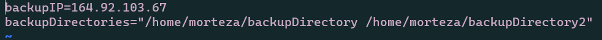

# ACIT 2420 - Week 11 Lab 
## Morteza Rahimi & Caleb Seeman
This lab utilizes two Ubuntu 20.10 Servers hosted on DigitalOcean's San Francisco Servers.

### Relevant Files
- backup-script
- backup-service.service
- backup-service.timer
- getWeather
- getWeather.service
- getWeather.timer

### Description
The backup-script is a shell script that utilizes rsync to backup directories to another remote server. The directories that are meant to be backed up, as well as the destination ip-address are provided by a config file that is then sourced inside the shell script.

This process is automated using a service and timer file. The former knows to run the backup-script onetime and the latter specifies that time to be 1AM each Friday with a 300 second offset to protect against overloading the system. These files can be found in the /etc/systemd/system/ directory and have been started/enabled.

